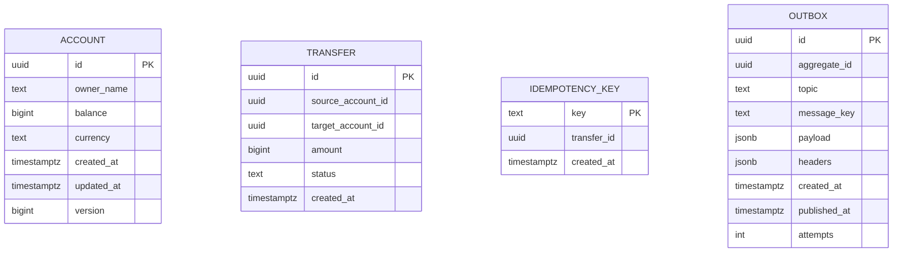

# Modelo de Dados - transfer-service

Escrita no PostgreSQL (transacional), leitura no MongoDB (read model). É a
separação de CQRS: cada lado modelado para o que faz melhor.

## Lado da escrita (PostgreSQL)



### `account` - conta e saldo

| Coluna | Tipo | Notas |
|---|---|---|
| `id` | uuid PK | UUID v7 (ordenável, não fragmenta índice) |
| `owner_name` | text | titular |
| `balance` | bigint | saldo em centavos - inteiro, nunca float (ver abaixo) |
| `currency` | text | BRL |
| `version` | bigint | `@Version`, lock otimista |

**Saldo em centavos como inteiro, nunca float/double.** Ponto flutuante tem erro
de arredondamento (0.1 + 0.2 != 0.3). Em dinheiro isso é inaceitável. Guardamos
o valor inteiro em centavos (R$ 10,50 -> 1050) e formatamos só na exibição.
Alternativa: `NUMERIC`/`BigDecimal`. Nunca `double`.

**`version` (lock otimista).** Duas transferências concorrentes que debitam a
mesma conta: a primeira commita e incrementa `version`; a segunda, que leu a
versão antiga, falha no commit e é reprocessada com o saldo atualizado. Evita o
"lost update" (dois débitos lendo o mesmo saldo inicial e um sobrescrevendo o
outro).

### `transfer` - o registro da transferência

| Coluna | Tipo | Notas |
|---|---|---|
| `id` | uuid PK | UUID v7 |
| `source_account_id` | uuid | conta debitada |
| `target_account_id` | uuid | conta creditada |
| `amount` | bigint | valor em centavos |
| `status` | text | COMPLETED (no MVP toda transferência é síncrona e final) |
| `created_at` | timestamptz | |

### `idempotency_key` - não duplicar a transferência

| Coluna | Tipo | Notas |
|---|---|---|
| `key` | text PK | o valor do header `Idempotency-Key` |
| `transfer_id` | uuid | a transferência criada por essa chave |
| `created_at` | timestamptz | |

Inserida na **mesma transação** da transferência. Se o cliente reenvia com a
mesma chave, o INSERT viola a PK, a transação faz rollback, e o serviço responde
com o resultado da transferência original (a `transfer_id` guardada) em vez de
executar de novo. Ver [ADR 0003](decisions/0003-idempotencia.md).

### `outbox` - eventos pendentes

| Coluna | Tipo | Notas |
|---|---|---|
| `id` | uuid PK | id da linha |
| `aggregate_id` | uuid | a transferência ou a conta de origem |
| `topic` | text | `transfer-events` |
| `message_key` | text | chave de partição = conta de origem |
| `payload` | jsonb | envelope do evento |
| `headers` | jsonb | eventType, schemaVersion, traceId |
| `published_at` | timestamptz null | NULL enquanto não publicado |
| `attempts` | int | tentativas de publicação |

Escrita na transação do comando. Relay publica e preenche `published_at`.
Ver [ADR 0001](decisions/0001-outbox-pattern.md).

## Lado da leitura (MongoDB) - CQRS

O extrato não precisa das garantias transacionais da escrita: é imutável (um
lançamento nunca muda depois de escrito), consultado sempre por conta e período,
e tolera segundos de atraso. É o caso clássico de read model separado.

### `statement` (extrato) - documento

```json
{
  "accountId": "uuid",
  "entries": [
    { "transferId": "uuid", "type": "DEBIT",  "amount": 1050, "counterparty": "uuid", "at": "..." },
    { "transferId": "uuid", "type": "CREDIT", "amount": 500,  "counterparty": "uuid", "at": "..." }
  ]
}
```

Ou uma coleção de lançamentos indexada por `accountId` + `at`, paginada por
cursor. Cada `transfer.completed` gera dois lançamentos: um DEBIT na conta de
origem, um CREDIT na de destino.

**Por que Mongo e não uma tabela no Postgres:** poderia ser uma tabela
desnormalizada no mesmo Postgres - CQRS é sobre separar o modelo, não
necessariamente o banco. Escolhi Mongo para exercitar persistência poliglota e
porque o extrato (documento por conta, alto volume de leitura por chave) encaixa
no modelo de documento. Em produção, a decisão dependeria de volume e operação.

### `processed_event` - idempotência do consumer

```json
{ "_id": "eventId", "processedAt": "..." }
```

O consumer grava o `eventId` antes de aplicar o lançamento; se já existe,
ignora. Diante do at-least-once do Outbox/Kafka, é o que impede lançar o mesmo
evento duas vezes no extrato. Ver [ADR 0003](decisions/0003-idempotencia.md).

## Resumo das decisões para entrevista

| Decisão | Por quê |
|---|---|
| Saldo em centavos (inteiro) | float tem erro de arredondamento; inaceitável em dinheiro |
| Lock otimista (`version`) | evita lost update em débitos concorrentes na mesma conta |
| idempotency_key na mesma transação | retry não duplica transferência |
| Outbox | consistência banco/broker sem 2PC |
| Extrato em read model (Mongo) | leitura barata, imutável, por conta; CQRS |
| UUID v7 | único e distribuído, ordenável, não fragmenta índice |