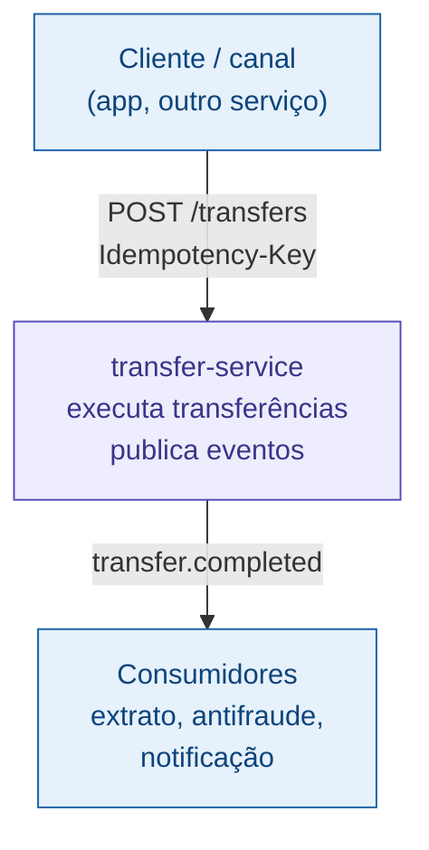
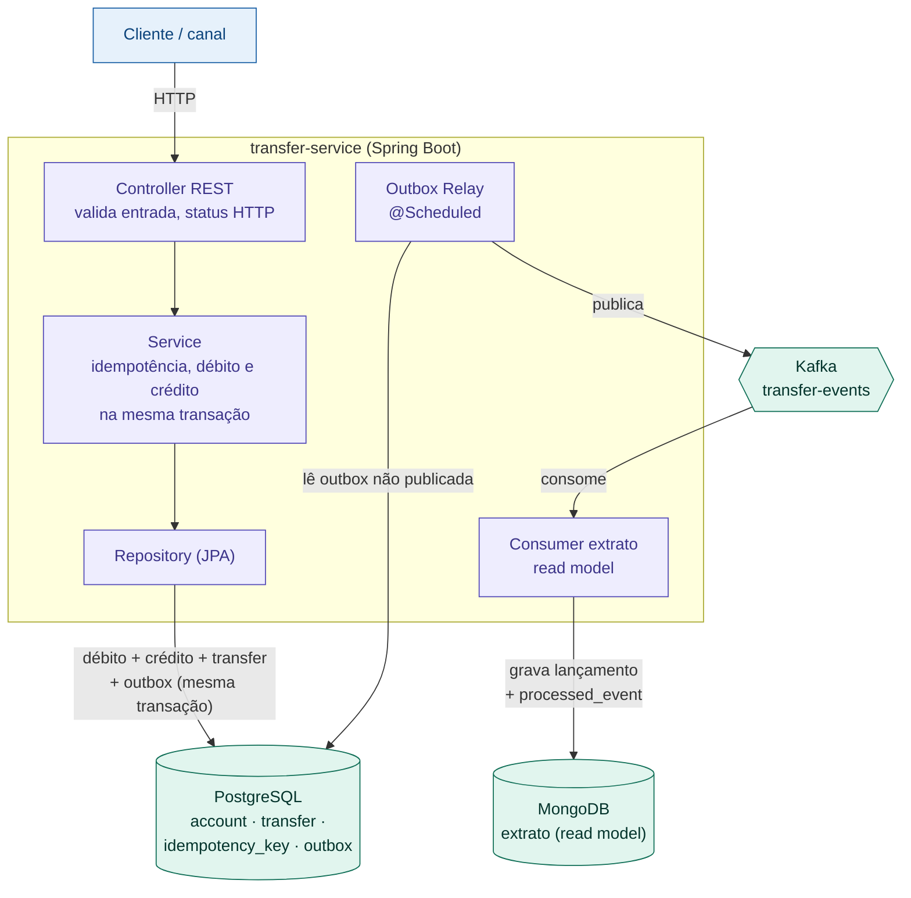
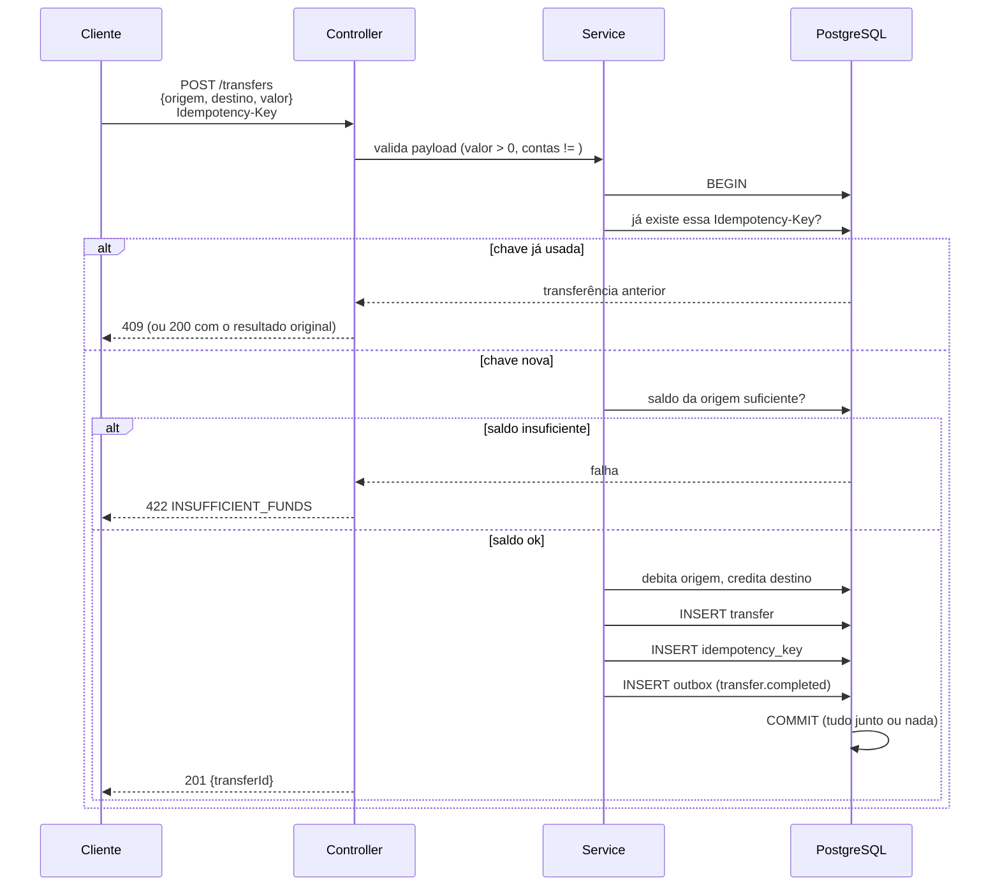
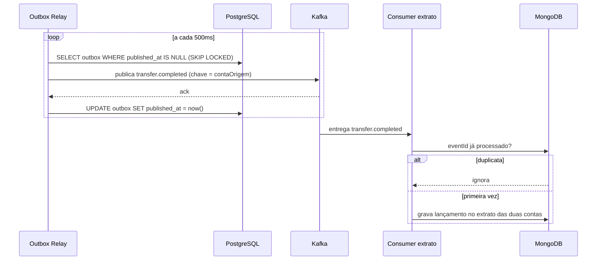

# Arquitetura - transfer-service

Como o serviço funciona, do request à propagação do evento. Notação: C4 Model.

## O problema

Transferir valor de uma conta para outra exige três garantias que, juntas, são o
que torna o problema interessante:

1. **Atomicidade:** debitar a origem e creditar o destino tem que ser tudo ou
   nada. Nunca debitar sem creditar.
2. **Idempotência:** se o cliente reenvia a mesma transferência (timeout, retry),
   ela não pode acontecer duas vezes.
3. **Propagação confiável:** extrato, antifraude e notificação precisam saber da
   transferência, sem que o cliente espere por isso.

## Princípio central: comando síncrono, propagação assíncrona

- **Comando (síncrono):** a transferência em si. O cliente precisa da resposta na
  hora - deu certo, saldo insuficiente, ou duplicata. Responde 201/409/422/400.
- **Propagação (assíncrona):** avisar o resto do sistema. O extrato, a antifraude
  e a notificação reagem ao evento `transfer.completed` depois, fora do request.

> O Kafka desacopla os **consumidores** do evento, não o **cliente** do comando.

Por que o débito/crédito é síncrono e não bufferizado numa fila: a resposta ao
cliente depende de uma verificação de consistência (saldo suficiente). Não dá
para responder "ok" antes de validar o saldo e efetuar o débito - senão dois
débitos concorrentes poderiam estourar o saldo. Validação e escrita da mesma
invariante ficam na mesma transação síncrona.

## C4 - Nível 1: Contexto

## C4 - Nível 2: Container

Repare no CQRS: a **escrita** (saldo, transferência) é transacional no Postgres;
a **leitura** (extrato) vive no MongoDB, alimentada pelo evento. O extrato é
imutável e consultado por conta e período - padrão de acesso conhecido, volume
alto, tolera atraso de segundos.

## Fluxo 1: executar transferência (síncrono)

Tudo dentro de um `BEGIN/COMMIT`: verificação de saldo, débito, crédito, registro
da transferência, chave de idempotência e evento na outbox. É a atomicidade que
garante que nunca há débito sem crédito, nem evento sem transferência.

## Fluxo 2: propagação (assíncrono)

## Modelo de dados (resumo)

| Tabela / coleção | Onde | Papel |
|---|---|---|
| `account` | Postgres | conta e saldo; escrita transacional |
| `transfer` | Postgres | registro da transferência (origem, destino, valor, status) |
| `idempotency_key` | Postgres | chaves já usadas, para não duplicar transferência |
| `outbox` | Postgres | eventos pendentes, escritos na transação do comando |
| `processed_event` | Mongo | ids de eventos consumidos (idempotência do consumer) |
| `statement` (extrato) | Mongo | read model: lançamentos por conta (CQRS) |

Detalhe em [`data-model.md`](data-model.md).

## Por que este desenho responde bem em entrevista

| Pergunta | Onde |
|---|---|
| Débito e crédito não podem divergir | mesma transação (Fluxo 1) |
| Retry não pode transferir duas vezes | Idempotency-Key (Fluxo 1 + ADR 0003) |
| Banco e broker consistentes | Outbox (ADR 0001) |
| Duplicata no consumer | processed_event (ADR 0003) |
| Ordem dos eventos | partição por conta de origem (ADR 0002) |
| Extrato sem pesar o banco de escrita | read model no Mongo via evento (CQRS) |
| Síncrono vs assíncrono | princípio central + os dois fluxos |